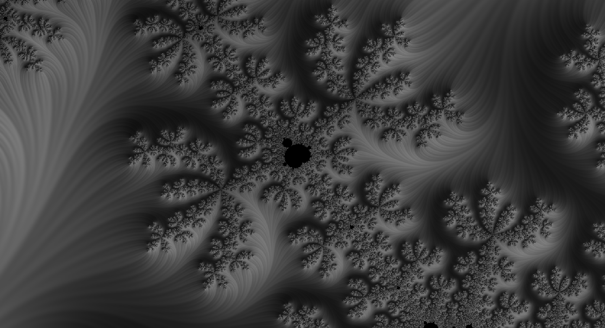

# qfract

qfract is small library that calculates mandelbrot set and some useful properties (like surface normal) for coloring. It is written in Rust with bindings for python.
The motivation for qfract was to learn Rust and because of my fascination with fractal coloring and due to extreme slowness of python implementation. 




## Install instructions

**from source**
```bash
git clone ...
pip install setuptools_rust
python setup.py install
```

## Features
At this moment there are 3 algorithms that more or less does the same but with slightly different result. Output of these algorithms is:
- Smooth iteration count
- Stripe Average
- Normal to surface
- Lambertian shading
- Distance

As far as calculation is concerned:
- Multi-core calculation with Rusts's Rayon
- Numpy output

## Sources
I heavily relied on these sources

Great source on beautiful mandelbrot coloring and stripe average coloring. Unfortunately very slow without GPU
1) https://github.com/jlesuffleur/gpu_mandelbrot/blob/master/mandelbrot.py

Calculation of lambertian shading, Optimization without complex numbers

2) https://www.fractalforums.com/general-discussion/stripe-average-coloring/

3) https://www.math.univ-toulouse.fr/~cheritat/wiki-draw/index.php/Mandelbrot_set

Unfortunately I could not get the main source of above mentioned sources, which is Masters Thesis **On Smooth Fractal Coloring Techniques** by Jussi Harkonen. Therefore I had to rely on these indirect sources.

#### TODO
- Optimize
    - Vec iteration is very slow
    - Add calculation options (choose what properties to calculate)
    - GPU
- Add new algorithms
  - Julia set
  - Add standard mandelbort (Now only smooth iteration count)
-  General refactor
    -  Clean up on both sides - Rust and Python
